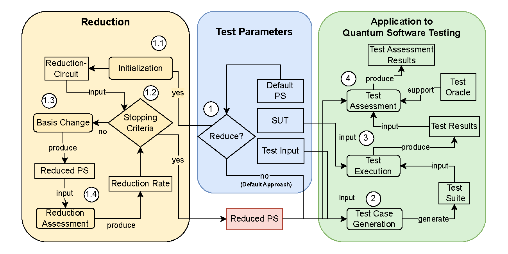

[](https://doi.org/10.48550/arXiv.2405.15450)

Faster and Better Quantum Software Testing through Specification Reduction and Projective Measurements, published in [TOSEM, 2025].
-
### **Keywords**: Test case reduction, Quantum software testing, Program specification, Projective measurements

This repository contains:
 
- **[experiments/](./experiments/)** - all related algorithms and source code for conducting the experiments:
- **[results/](./results/)** - all the raw data and postprocessed results from the experiments:
- **[data_analysis/](./data_analysis/)** - the analysis scripts and source files for creating figures and tables:

TL;DR:
-
We introduce a Quantum Software Testing (QST) approach that reduces and utilizes quantum program specifications, speeding up testing and catching phase flip faults. Mutation test on 143 quantum programs show:

* Test runtimes slashed from ~170s to ~12s
* Mutation scores boosted from ~55% to ~75%

This reduction-based approach significantly improves QST efficiency and effectiveness compared to testing with non-reduced specifications.

Description:
-
Quantum computing promises polynomial and exponential speedups in many domains, such as unstructured search and prime number factoring. However, quantum programs yield probabilistic outputs from exponentially growing distributions and are vulnerable to quantum-specific faults. Existing quantum software testing (QST) approaches treat quantum superpositions as classical distributions. This leads to two major limitations when applied to quantum programs: (1) an exponentially growing sample space distribution and (2) failing to detect quantum-specific faults such as phase flips. To overcome these limitations, we introduce a QST approach, which applies a reduction algorithm to a quantum program specification. The reduced specification alleviates the limitations (1) by enabling faster sampling through quantum parallelism and (2) by performing projective measurements in the mixed Hadamard basis. Our evaluation of 143 quantum programs across four categories demonstrates significant improvements in test runtimes and fault detection with our reduction approach. Average test runtimes improved from 169.9s to 11.8s, with notable enhancements in programs with large circuit depths (383.1s to 33.4s) and large program specifications (464.8s to 7.7s). Furthermore, our approach increases mutation scores from 54.5% to 74.7%, effectively detecting phase flip faults that non-reduced specifications miss. These results underline our approach's importance to improve QST efficiency and effectiveness.

ReduQt Overview:
-


## Prerequisites

Before running the experiments, ensure you have the following installed:

- **Python 3.8+**
- Required Python libraries:
  - **Qiskit 0.45.1**
  - **NumPy**
  - **SciPy**
  - **Pandas**
  - **Matplotlib**
  - **Seaborn**

You can install all dependencies at once using the `requirements.txt` file located in the root directory:
```bash
pip install -r requirements.txt
```
 
## Replication Process

Follow the steps below to replicate the experiments and results described in the paper:

---

### **Step 1: Experiment 1**
1. Navigate to the `experiments/Experiment1` directory and run:
   ```bash
   python experiment1_main.py
   ```

Before running the script, modify the following variables in the code:

```
# Number of repetitions for Experiment 1
r1 = 100

# Approach to use; start with "greedy"
approach = "greedy"  # or "random"
```

This executes the greedy approach for Experiment 1.
Copy the 3 result files from:

```
experiments/Experiment1/results_experiment1/
```

to:

```
results/results_experiment1_greedy/
```

Repeat steps 1 and 2 for the random approach.

### **Step 2: Experiment 2**
Navigate to the experiments/Experiment2 directory and run:

```bash
python mutant_generator.py
```

This generates mutants for Experiment 2.

Run the greedy approach for Experiment 2:

```bash
python experiment2_main.py
```

Before running the script, modify the following variable in the code:

```
# Approach to use; start with "greedy"
approach = "greedy"  # or "random"
```
Additionally, provide a command-line argument (an integer starting from 0) when running experiment2_main.py. This argument enables parallelization of the experiments.

Copy the results from:

```
experiments/Experiment2/results_experiment2/
```

to:

```
results/results_experiment2_greedy/
```

Repeat steps 2 and 3 for the random approach.

### **Step 3: Postprocessing**

Run the following scripts in the results/postProcessing/ directory:
```bash
python add_median_runtimes_combine_results.py
python create_run_all_data.py
```

### **Step 4: Data Analysis**

Analyze data for each research question by running the appropriate scripts in the data_analysis/ directory:

### **RQ1**

```
python full_tables_reduction_rate.py
python full_tables_runtime.py
```

### **RQ2**
```
python full_tables_runtime.py
```

### **RQ3**
```
python full_tables_mutation_score.py
python summary_tables_mutation_score.py
```

---

## License

This project is licensed under the **[GNU Affero General Public License v3.0](./LICENSE)**.  
You are free to use, modify, and distribute this software under the terms of the AGPL. See the [LICENSE](./LICENSE) file for more details.
